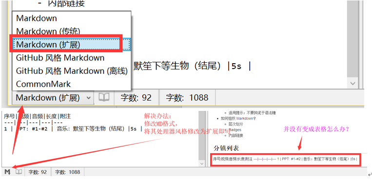

#Markdown学习笔记

&nbsp;&nbsp;&nbsp;&nbsp;&nbsp;&nbsp;&nbsp;&nbsp;&nbsp;&nbsp;&nbsp;&nbsp;&nbsp;&nbsp;&nbsp;&nbsp;&nbsp;&nbsp;&nbsp;&nbsp;&nbsp;&nbsp;&nbsp;&nbsp;&nbsp;&nbsp;&nbsp;&nbsp;&nbsp;&nbsp;&nbsp;&nbsp;&nbsp;&nbsp;&nbsp;&nbsp;&nbsp;&nbsp;**______________小清**

## 一. 学习内容
1. Markdown 概述  
   
	Markdown 是一种基于普通文本的标记语言，它可以使普通文本内容具有一定的格式。

2. Markdown 语法  

	（1） 标题  

	- H1~H6：分别用1到6个 # 号表示

	（2）文本样式

	- 加粗： \*\*  加粗内容 **
	- 强调： \*  强调内容  \*  &nbsp;&nbsp;或者&nbsp;&nbsp; \_  强调内容  \_ 
	- 无序列表： \* 空格  &nbsp;&nbsp;或者&nbsp;&nbsp; \+ 空格或者&nbsp;&nbsp; \- 空格*(是减号不是下划线)* 
	- 有序列表：数字加点*（例如：1.）*
	- 分割符： --- &nbsp;&nbsp;或者&nbsp;&nbsp; ***
	- 引用： \> 引用内容
	- 代码引用： \` 单行代码 \` &nbsp;&nbsp;或者&nbsp;&nbsp; \`\`\` 多行代码 \`\`\`
	- 邮箱：<邮箱地址>

	（3）链接

	- 显示链接: <链接地址>
	- 文本链接：[显示文本]\(链接地址\)
	
	（4）图片

	- \!\[\]\(图片链接地址\)
	
	（5）表格

	- 第一行表头： 条目1\|条目2\|条目3
	- 第二行格式： :---:|:---:|:---: *（注意：冒号表示对其方式，只放左边居左，只放右边居右，两边均放为居中本例中为居中）*
	- 第三行开始为内容： 项目1\|项目2一\|项目3

	（6）常用转义字符表

	显示结果|描述|名称|编号
	:---:|:---:|:---:|:---:
	 |空格|`&nbsp;`|`&#160;`
	\<|小于号|`&lt;`|`&#60;`
	\>|大于号|`&gt;`|`&#62;`
	\&|和号|`&amp;`|`&#38;`
	"|引号号|`&quot;`|`&#34;`
	'|撇号|`&apos;`|`&#39;`

		
## 二. 遇到的问题及解决办法

* <font color='red'>问题1： \<p\>这是一个\*\*错误\*\*的例子</p\> 在前面这句中，错误两字并不会加粗。</font>

	解决：新版 markdown 中字体加粗不能和<>标签一起用，上面这句应该去掉 \<p\></p\> 这对标签

* <font color='red'>问题2：下面的代码片段并没生成无序列表

	```	
	-Visual Studio Code

	-Microsoft PowerPoint

	-iMovie
	```
	</font>

	解决：有序列表由数字 + 英文句号 + 空格 + 列表内容标记，无序列表由星号/加号/减号 + 空格 + 列表内容标记。<font color='blue'>一定不要忘记空格。</font>所以，需要在上面代码的减号后面加上一个空格。

* <font color='red'>问题3： 如下图所示，使用二维表结构时，语句正确，但是却不显示表格</font>

	

	解决：如上图所示，改变 markdown 的处理器风格为扩展即可


## 三. 注意事项

 * （1） Markdown 本身并不做任何的页面渲染工作，当编译为html页面后，其生命周期就结束了。
 * （2） 针对不同标题级别采用不同个数的#号后，#号后面最好跟一个空格，可以规范自己的文档。

## 四. 感悟

&nbsp;&nbsp;&nbsp;&nbsp;其实不是第一次使用 Markdown 了，但是以前都没有认真、仔细的去研究过，总是需要什么就找什么就可以了。这次认真学习了一下，  虽然其语法看似简单，就像记HTML标签一样，且没有HTML标签那么繁多，但是，要灵活的使用，还需要勤加练习才可以。
在这次学习中，遇到了一些问题，有些是确实是之前不知道的，但有些却是不细心造成的，比如少空格的操作。希望自己后面能多练习练习，做
事情也更仔细一些。继续努力吧！
